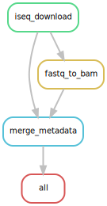

[](https://github.com/epigen/MrBiomics/)
[](https://doi.org/10.5281/zenodo.15005419)
[]() 
[]()
[](https://github.com/epigen/fetch_ngs/blob/main/LICENSE)

[](https://snakemake.readthedocs.io/en/stable/)

# Fetch Public Sequencing Data and Metadata Using iSeq
A [Snakemake 8](https://snakemake.readthedocs.io/en/stable/) workflow to fetch (download) and process public sequencing data and metadata from **[GSA](https://ngdc.cncb.ac.cn/gsa/)**, **[SRA](https://www.ncbi.nlm.nih.gov/sra/)**, **[ENA](https://www.ebi.ac.uk/ena/)**, **[GEO](https://www.ncbi.nlm.nih.gov/geo/)** and **[DDBJ](https://www.ddbj.nig.ac.jp/)** databases using [iSeq](https://github.com/BioOmics/iSeq).

> [!NOTE]  
> This workflow adheres to the module specifications of [MrBiomics](https://github.com/epigen/MrBiomics), an effort to augment research by modularizing (biomedical) data science. For more details, instructions, and modules check out the project's repository.
>
> ⭐️ **Star and share modules you find valuable** 📤 - help others discover them, and guide our future work!

> [!IMPORTANT]  
> **If you use this workflow in a publication, please don't forget to give credit to the authors by citing it using this DOI [10.5281/zenodo.15005419](https://doi.org/10.5281/zenodo.15005419).**



# 🖋️ Authors
- [Stephan Reichl](https://github.com/sreichl)
- [Christoph Bock](https://github.com/chrbock)


# 💿 Software
This project wouldn't be possible without the following software and their dependencies.

| Software | Reference (DOI) |
| :---: | :---: |
| iSeq | https://github.com/BioOmics/iSeq |
| pandas         | https://doi.org/10.5281/zenodo.3509134            |
| Picard | https://broadinstitute.github.io/picard/ |
| Snakemake | https://doi.org/10.12688/f1000research.29032.2 |


# 🔬 Methods
This is a template for the Methods section of a scientific publication and is intended to serve as a starting point. Only retain paragraphs relevant to your analysis. References [ref] to the respective publications are curated in the software table above. Versions (ver) have to be read out from the respective conda environment specifications (`workflow/envs/*.yaml file`) or post-execution in the result directory (`{module}/envs/*.yaml`). Parameters that have to be adapted depending on the data or workflow configurations are denoted in squared brackets e.g., [X].

__Data Acquisition & Processing.__ Public sequencing data were retrieved from [GSA|SRA|ENA|DDBJ] under the accession(s) [accession_ids] using iSeq (ver) [ref]. The data were downloaded as FASTQ files (and converted to unmapped BAM ([uBAM](https://gatk.broadinstitute.org/hc/en-us/articles/360035532132-uBAM-Unmapped-BAM-Format)) files using Picard FastqToSam (ver) [ref], preserving sample information and read groups while supporting both single-end and paired-end sequencing data).  Metadata for each dataset was collected and merged into a single Comprehensive reference file.

**The data acquisition and processing described here were performed using a publicly available Snakemake (ver) [ref] workflow [10.5281/zenodo.15005419](https://doi.org/10.5281/zenodo.15005419).**

# 🚀 Features
The workflow performs the following steps that produce the outlined results:

- Data Acquisition
  - Downloads sequencing data from public repositories **[GSA](https://ngdc.cncb.ac.cn/gsa/)**, **[SRA](https://www.ncbi.nlm.nih.gov/sra/)**, **[ENA](https://www.ebi.ac.uk/ena/)**, and **[DDBJ](https://www.ddbj.nig.ac.jp/)** using various [accession ID types](https://github.com/BioOmics/iSeq/blob/main/README.md#1--i---input)
  - Extracts comprehensive metadata for each dataset
  - Supports parallel downloading for improved performance using threads
- Data Processing
  - Automatic handling of both single-end and paired-end sequencing data
  - Creation of a unified comprehensive metadata file with accession IDs and file paths
  - Optional conversion from `FASTQ` (as `*.fastq.gz`) to [unmapped BAM](https://gatk.broadinstitute.org/hc/en-us/articles/360035532132-uBAM-Unmapped-BAM-Format)(as `*.bam`) format using [Picard's](https://broadinstitute.github.io/picard/) [FastqToSam](https://gatk.broadinstitute.org/hc/en-us/articles/360036351132-FastqToSam-Picard)
- Metadata-only mode for quick exploration without downloading sequence files (`metadata_only: 1`)
- Considerations
  - Dependent on iSeq's supported repositories and accession types
  - Requires internet connectivity and sufficient storage space for downloaded data

The workflow produces the following directory structure:

```
{result_path}/
└── fetch_ngs/
    ├── metadata.csv                # merged metadata for all accessions
    ├── .fastq_to_bam/              # processing marker files
    │   └── [accession].done
    └── [accession]/                # one directory per accession
        ├── [accession].metadata.csv  # metadata for this accession
        └── [sample].[bam/fastq.gz]   # sequence files
```

# 🛠️ Usage
Here are some tips for the usage of this workflow:
- Specify accession IDs in the configuration file as a list to download multiple datasets in one run
- Use `metadata_only: 1` for a quick preview of available data before committing to full downloads
- Choose between `FASTQ` or `BAM` output formats based on your downstream analysis needs
- For large datasets, consider increasing `threads` and `mem` parameters
- The merged metadata file can be used as a basis for sample annotation files downstream
- BAM output format (`output_format: bam`) is recommended for direct integration with BAM compatible downstream analysis workflows

# ⚙️ Configuration
Detailed specifications can be found here [./config/README.md](./config/README.md)

# 📖 Examples
 Explore detailed examples showcasing module usage in comprehensive end-to-end analyses (including data, configuration, annotation and results) in our [MrBiomics Recipes](https://github.com/epigen/MrBiomics?tab=readme-ov-file#-recipes):
- [ATACseq Analysis Recipe](https://github.com/epigen/MrBiomics/wiki/ATACseq-Analysis-Recipe)
- [RNAseq Analysis Recipe](https://github.com/epigen/MrBiomics/wiki/RNAseq-Analysis-Recipe)

# 🔗 Links
- [GitHub Repository](https://github.com/epigen/fetch_ngs/)
- [GitHub Page](https://epigen.github.io/fetch_ngs/)
- [Zenodo Repository](https://doi.org/10.5281/zenodo.15005419)
- [Snakemake Workflow Catalog Entry](https://snakemake.github.io/snakemake-workflow-catalog?usage=epigen/fetch_ngs)

# 📚 Resources
- Recommended compatible [MrBiomics Modules](https://github.com/epigen/MrBiomics/#-modules) for downstream analyses:
  - [ATAC-seq Data Processing & Quantification Pipeline](https://github.com/epigen/atacseq_pipeline) for processing, quantification and annotation of chromatin accessibility.
  - [Genome Browser Track Visualization](https://github.com/epigen/genome_tracks/) for quality control and visual inspection/analysis of genomic regions/genes of interest or top hits.
  - [<ins>Sp</ins>lit, F<ins>ilter</ins>, Norma<ins>lize</ins> and <ins>Integrate</ins> Sequencing Data](https://github.com/epigen/spilterlize_integrate/) after count quantification.
  - [Differential Analysis with limma](https://github.com/epigen/dea_limma) to identify and visualize statistically significantly different features (e.g., genes or genomic regions) between sample groups.
  - [Enrichment Analysis](https://github.com/epigen/enrichment_analysis) for biomedical interpretation of (differential) analysis results using prior knowledge.
  - [Unsupervised Analysis](https://github.com/epigen/unsupervised_analysis) to understand and visualize similarities and variations between cells/samples, including dimensionality reduction and cluster analysis. Useful for all tabular data including single-cell and bulk sequencing data.


# 📑 Publications
The following publications successfully used this module for their analyses.
- [FirstAuthors et al. (202X) Journal Name - Paper Title.](https://doi.org/10.XXX/XXXX)
- ...

# ⭐ Star History

[](https://star-history.com/#epigen/fetch_ngs&Date)
